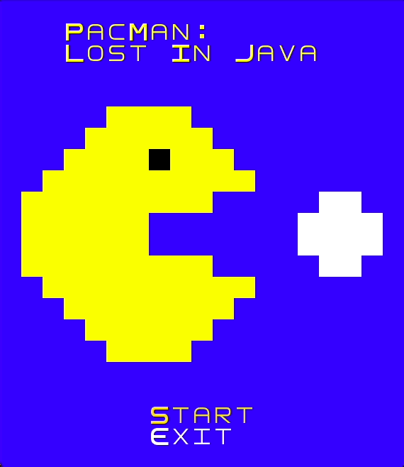
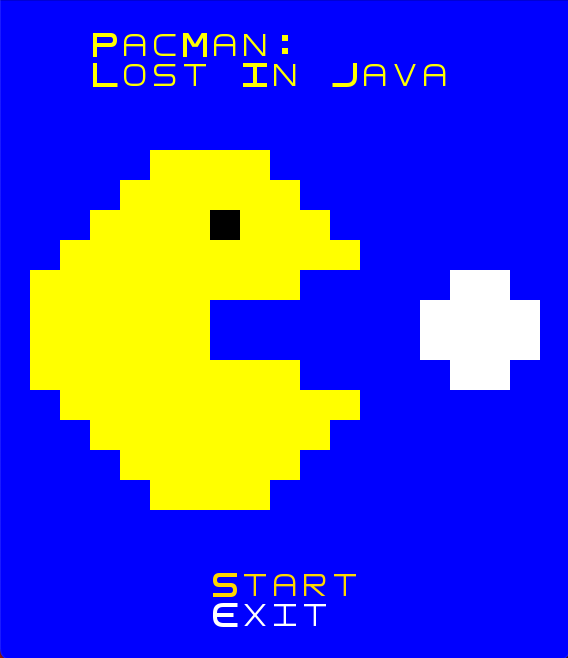

## LDTS_0907 - PacMan: Lost in Java

## Game Description

In this Pac-Man game, you control the titular character as you navigate through a 2D maze, collecting power pellets and avoiding the four ghost enemies ("Blinky", "Pinky", "Inky", and "Clyde") that are trying to catch you. Your goal is to reach the highest score possible and win the game. However, if you get hit by a ghost three times, it will be game over and you will need to start again.

This project was developed by João Guedes (up202108711@fe.up.pt), João Sousa(up202106996@fe.up.pt), and Miguel Xu (up201905395@fe.up.pt).

For a more detailed version of this description click [here](./docs/README.md)

## Screenshots

The following screenshots illustrate the general look of our game:

### Game Preview

### Menu

### Game Screen

### Game Over Screen

### Win Screen

