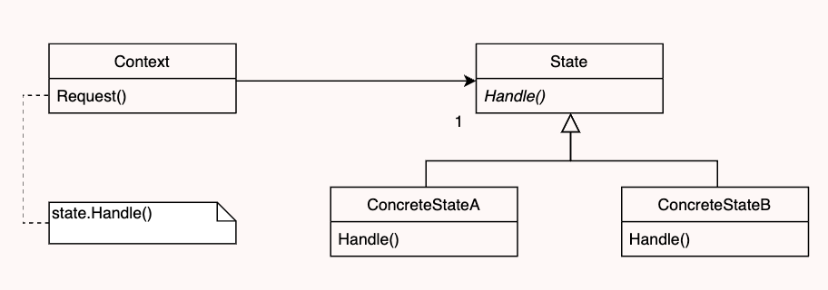

# LDTS_0907 - PacMan: Lost in Java

## Game Description

In this Pac-Man game, you control the titular character as you navigate through a 2D maze, collecting power pellets and avoiding the four ghost enemies ("Blinky", "Pinky", "Inky", and "Clyde") that are trying to catch you. Your goal is to reach the highest score possible and win the game. However, if you get hit by a ghost three times, it will be game over and you will need to start again.

This project was developed by João Guedes (up202108711@fe.up.pt), João Sousa(up202106996@fe.up.pt), and Miguel Xu (up201905395@fe.up.pt).

## IMPLEMENTED FEATURES

- **Moving** - Pac-Man will be able to move through the maze by using the arrow keys.
- **Eating Pellets** - When Pac-Man moves over a pellet it eats it, while gaining points.
- **Moving Ghost** - The Ghosts move randomly with the chance of hitting you three times and it's Game Over.
- **Score** - Every time Pac-Man eats a dot the player's score goes up and the dot disappears.
- **Keyboard Control** - The player is able to use the arrow key to control Pac-Man and navigate through the menu.

## PLANNED FEATURES

- **Special Dots** - When Pac-Man eats the special dot his able to eat/kill the Ghosts.
- **Levels Menu** - In the Menu, you will be able to choose three difficulties with at least one level each.
- **Score Menu** - In this menu, you'll be able to see your past scores.

## DESIGN 

### General Structure
#### Problem in Context:
One of the key challenges we faced during the development of our game was deciding on an appropriate structure and design pattern to use. The game includes elements such as a GUI, a user-controlled character (Pac-Man), and multiple enemies that move around the character. We needed to find a way to effectively manage the interactions between these elements, including the visual graphics, user inputs, and data storage. This required careful consideration and planning in order to create a cohesive and functional game.

#### The Pattern:
We decided to apply the **Architectural Pattern**, which deals with the architectural style of the program and whose style is responsible fow how we should organize our code. And since we were designing a GUI-based game, we decided the apply the **Model-View-Controller** (MVC) style.

#### Implementation:
We implemented this design pattern by following its main idea: 
- Model: classes which store the data, logic and rules of the game;
- View: classes that create the visuals of the game (graphics);
- Controller: classes that take the user inputs and translates it into commands/actions, they control how the game operates and functions.

  

  <b><i>Fig 1. Model, Controller and Viewer pattern design</i></b>

#### Consequences:
The Architectural Pattern allows for the following consequences:
- facilites simultaneous development, making it easier to add new features;
- makes it easier to test each element seperatly;
- the code is more organizes.

### Building The Game
#### Problem in Context:
In our game, we have a variety of different elements, such as the maze, Pac-Man, the ghosts, and the menu, each of which has its own unique attributes, commands, and graphics. To manage this complexity, we have implemented each element as a separate class, allowing us to instantiate the specific objects we need. This design allows us to create and manipulate each element in a specific and specialized way, helping us to build a cohesive and functional game.

#### The Pattern:
We decided to use the **Factory Method**, because it defines an interface for creating an object, and allows sub-classes to decide which class to instantiate. And, we also used the **Builder Method** which provides a flexible solution to various object creation by allowing you to construct objects step-by-step making a simpler code.

#### Implementation:
We implemented these design patterns by following their main idea:
- class that can't anticipate the class of objects it must create;
- class wants the subclasses to specify the objects it creates;
- classes delegate responsibility to one of several helper classes, and want to localize the knowledge of which helper subclass is the delegate.

  

  <b><i>Fig 2. Factory Pattern Design</i></b>

  

  <b><i>Fig 3. Builder Pattern Design</i></b>

#### Consequences:
The Factory and Builder Pattern allowed for these consequences:
- Eliminate the need to bind application-specific classes;
- Code only needs to deal with the interface;
- Construct objects step-by-step, defer construction steps or run steps recursively:
- Open/closed principle

### Different Menus
#### Problem in Context:
In the development of our game, we planned to have multiple menus to serve different purposes. These included an initial main menu, which would provide options to start the game or quit and would feature a visual representation of Pac-Man and the title of the game; a Game Over menu, which would allow the player to try again or quit after a loss; and a You Win! screen to celebrate the player's victory. By designing our code to be able to change the state of the menu according to its behavior, we were able to create a smooth and intuitive experience for the player.

#### The Pattern:
We decided to use the **State Pattern**, as it would allow an object to alter its behaviour when its internal state changes. The object in question would appear to change its class. 

#### Implementation:
The implementation of this design pattern makes sure the object behaviour depends on its state, and that it must change that state in run-time. This way when playing the game, when you select an option, lose or win; the game’s code understands that the state must change and the player sees the behavioural change without interruption. These operations tend to have large conditional statements that are dependent one or more enumerated constants.

  

  <b><i>Fig 4. State Pattern Design</i></b>

#### Consequences:
The consequences of using this design pattern are:
- It localizes and partitions behaviour for different states;
- Makes state transitions explicit.

### Graphics Interface
#### Problem in Context:
In order to manage the complexity of the Lanterna library, which plays a significant role in our game, we decided to encapsulate the various subsystems behind a simple interface. This helped to hide much of the complexity of the library and made it easier for us to use as we developed our game. By providing a clear and straightforward interface, we were able to focus on building the game without getting bogged down in the details of the underlying library. This approach allowed us to develop our game more efficiently and effectively, while still making use of the powerful features of the Lanterna library.

#### The Pattern:
We decided to implement	 the **Facade Pattern**,  it provides an interface to a complex system which contains multiple moving parts, allowing us to only include the features that really matter.

#### Implementation:

  

  <b><i>Fig 5. Façade Pattern Design</i></b>

#### Consequences:
The consequences of using the Facade Pattern were:
- Isolating the code from a complex system;
- Having easier testability and replaceability;
- Expand Lanterna;
- Interface Segregation Principle.

### User Inputs and Game Outputs
#### Problem in Context:
In our game, the keyboard is the main way for the player to control the action. The arrow keys, enter, and the 'q' key (for quitting) are all used to issue commands to the game. To facilitate this, we have implemented observer objects which listen for changes and adjust the game state accordingly when a command is received. These observers help to ensure that all relevant objects in the game are updated and respond appropriately when the player makes a move or issues a command. This allows the game to react smoothly and accurately to the player's input.

#### The Pattern:
We decided to use the **Observer Pattern**, it defines a one-to-many dependency between objects so that when one object changes status all its dependents are notified and updated automatically.

#### Implementation:

  

  <b><i>Fig 6. Observer Pattern Design</i></b>

#### Consequences:
The consequences of using this design pattern are:
- Abstract coupling between subject and observer;
- Support for broadcast communication;
- Unexpected updates;
- Clean code;
- Single Responsibility Principle;
- Only the current game is warned when input is given.

## KNOWN CODE SMELLS AND REFACTORING SUGGESTIONS

#### Data Class
In the MVC (Model-View-Controller) architectural pattern, the responsibility for implementing the logic and functionalities of each model falls on the controller. As a result, model classes are often designed as "dumb" classes, containing only fields and no behavior. While this may be considered a code smell in some contexts, it is a necessary consequence of the MVC design pattern.

#### Large Class
It is generally accepted that classes should follow the "single responsibility principle", meaning that they should have a single, well-defined purpose and should not be responsible for too many things. However, there may be situations where it is necessary for a class to have a large number of fields or methods in order to fulfill its responsibilities. For example, in the case of a class like Game, it may be necessary for it to have a large number of fields in order to store all of the data that is relevant to the game state. Similarly, a class like Graphics interface may require a large number of methods in order to provide all of the necessary functionality for the user interface. In these cases, it may be necessary to accept that the class has a larger number of fields or methods in order to fulfill its intended purpose. However, it is still important to be mindful of the size of your classes and to try to avoid making them too large or complex. If a class becomes too large or complex, it can become difficult to understand and maintain, and it may be a sign that the class should be broken up into smaller, more focused classes.

#### Feature envy
Due to the MVC (Model-View-Controller) pattern, some controllers may be limited to making method calls to their associated models. This means that in order to access the parameters of a particular model, it is necessary to go through the controller first. This can create a dependency between the controller and the model, with the controller relying on the model to perform certain tasks. It is important to consider this relationship when designing and implementing the controllers and models in an MVC system.

## TESTING

Coverage report:

  

Mutation testing report:

  

## SELF-EVALUATION
We used a divide-and-conquer approach to developing your game, assigning different features or elements of the game to each team member. It allowed each team member to focus on a specific area of the game. However, as we progressed through the development process, we also ended up collaborating and helping each other out on different features as needed. This approach can be beneficial in ensuring that the game is developed efficiently and effectively, as it allows team members to support each other and share their expertise.

- João Guedes: 50%
- João Sousa: 50%
- Miguel Xu: 0%
